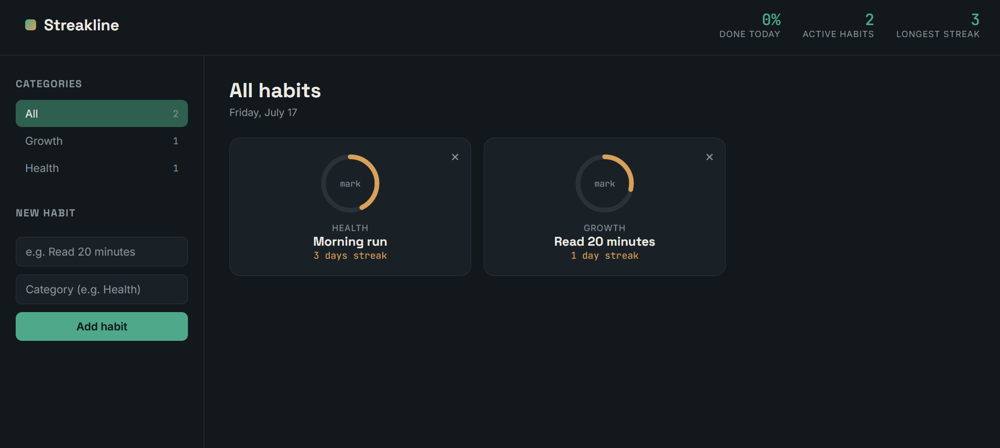

# Streakline

A minimal habit tracker built with vanilla JavaScript, HTML, and CSS — no frameworks, no build step. Open `index.html` and it runs.

**[Live demo](https://gus-242.github.io/habit-tracker/)** — *replace this link once deployed (see below)*



## Features

- Add habits with a name and category
- Mark a habit done for the day with one click
- Automatic streak calculation (consecutive days completed)
- A radial progress ring per habit showing the last 7 days' completion rate
- Filter habits by category
- Data persists locally in the browser (`localStorage`) — no backend required
- Responsive layout, keyboard-accessible controls, respects reduced-motion preference

## Why this project

This is a portfolio piece meant to demonstrate:
- Clean, framework-free DOM manipulation and state management
- Working with dates and derived data (streaks, weekly rates) without a library
- Deliberate UI/UX decisions (a custom SVG progress ring, empty states, accessible focus styles)

## Tech stack

- HTML5, CSS3 (custom properties, CSS Grid)
- Vanilla JavaScript (ES2021+, `crypto.randomUUID`)
- Google Fonts (Space Grotesk, Inter, JetBrains Mono)

## Run locally

No build tools needed:

```bash
git clone https://github.com/Gus-242/habit-tracker.git
cd habit-tracker
# open index.html directly in a browser, or serve it:
python3 -m http.server 8000
```

Then visit `http://localhost:8000`.

## Deploy

The project is fully static, so any static host works. Easiest option: **GitHub Pages**.

1. Push this repo to GitHub.
2. Go to the repo's **Settings → Pages**.
3. Under "Build and deployment", set source to the `main` branch, root folder.
4. Your live URL will appear at `https://<your-username>.github.io/habit-tracker/`.

## Roadmap

- [ ] Optional cloud sync (currently local-only by design)
- [ ] Export/import data as JSON
- [ ] Dark/light theme toggle

## License

MIT
